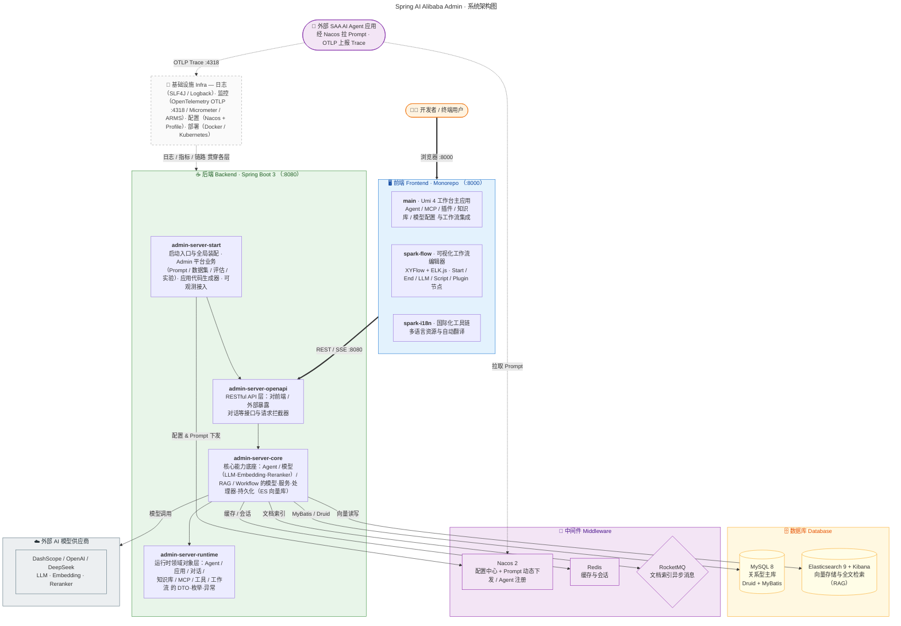

# 系统架构图（Mermaid 源码）

> 渲染图见同名 SVG：[01-architecture.svg](./01-architecture.svg)
> 分层：前端 → 后端 → 数据库 / 中间件 → 外部 AI；基础设施单框概括。

```mermaid
---
title: Spring AI Alibaba Admin · 系统架构图
---
flowchart TB

  %% ===== 外部参与者 =====
  User(["👨‍💻 开发者 / 终端用户"])
  ExtAgent(["🤖 外部 SAA AI Agent 应用<br/>经 Nacos 拉 Prompt · OTLP 上报 Trace"])

  %% ===== 前端层 =====
  subgraph FE["🖥️ 前端 Frontend · Monorepo （:8000）"]
    direction LR
    FEMain["<b>main</b> · Umi 4 工作台主应用<br/>Agent / MCP / 插件 / 知识库 / 模型配置 与工作流集成"]
    FEFlow["<b>spark-flow</b> · 可视化工作流编辑器<br/>XYFlow + ELK.js · Start / End / LLM / Script / Plugin 节点"]
    FEI18n["<b>spark-i18n</b> · 国际化工具链<br/>多语言资源与自动翻译"]
  end

  %% ===== 后端层 =====
  subgraph BE["☕ 后端 Backend · Spring Boot 3 （:8080）"]
    direction LR
    BStart["<b>admin-server-start</b><br/>启动入口与全局装配 · Admin 平台业务<br/>（Prompt / 数据集 / 评估 / 实验）· 应用代码生成器 · 可观测接入"]
    BApi["<b>admin-server-openapi</b><br/>RESTful API 层：对前端 / 外部暴露<br/>对话等接口与请求拦截器"]
    BCore["<b>admin-server-core</b><br/>核心能力底座：Agent / 模型（LLM·Embedding·Reranker）/<br/>RAG / Workflow 的模型·服务·处理器·持久化（ES 向量库）"]
    BRT["<b>admin-server-runtime</b><br/>运行时领域对象层：Agent / 应用 / 对话 /<br/>知识库 / MCP / 工具 / 工作流 的 DTO·枚举·异常"]
  end

  %% ===== 数据库层 =====
  subgraph DB["🗄️ 数据库 Database"]
    direction LR
    MySQL[("MySQL 8<br/>关系型主库<br/>Druid + MyBatis")]
    ES[("Elasticsearch 9 + Kibana<br/>向量存储与全文检索（RAG）")]
  end

  %% ===== 中间件层 =====
  subgraph MW["🔗 中间件 Middleware"]
    direction LR
    Nacos["Nacos 2<br/>配置中心 + Prompt 动态下发 / Agent 注册"]
    Redis["Redis<br/>缓存与会话"]
    RocketMQ{"RocketMQ<br/>文档索引异步消息"}
  end

  %% ===== 外部 AI =====
  subgraph AI["☁️ 外部 AI 模型供应商"]
    Models["DashScope / OpenAI / DeepSeek<br/>LLM · Embedding · Reranker"]
  end

  %% ===== 基础设施（一个方框概括）=====
  Infra["🧰 基础设施 Infra — 日志（SLF4J / Logback）· 监控（OpenTelemetry OTLP :4318 / Micrometer / ARMS）· 配置（Nacos + Profile）· 部署（Docker / Kubernetes）"]

  %% ===== 主链路 =====
  User ==>|浏览器 :8000| FE
  FE ==>|REST / SSE :8080| BApi
  BStart --> BApi --> BCore --> BRT

  BCore -->|MyBatis / Druid| MySQL
  BCore -->|向量读写| ES
  BCore -->|缓存 / 会话| Redis
  BCore -->|文档索引| RocketMQ
  BStart -->|配置 & Prompt 下发| Nacos
  BCore -->|模型调用| AI

  %% ===== 外部 Agent / 基础设施贯穿 =====
  ExtAgent -.拉取 Prompt.-> Nacos
  ExtAgent -.OTLP Trace :4318.-> Infra
  Infra -.日志 / 指标 / 链路 贯穿各层.-> BE

  %% ===== 样式 =====
  style FE fill:#e3f2fd,stroke:#1976d2,color:#0d47a1
  style BE fill:#e8f5e9,stroke:#388e3c,color:#1b5e20
  style DB fill:#fff8e1,stroke:#f9a825,color:#e65100
  style MW fill:#f3e5f5,stroke:#8e24aa,color:#4a148c
  style AI fill:#eceff1,stroke:#546e7a,color:#263238

  style User fill:#fff3e0,stroke:#ef6c00,color:#333
  style ExtAgent fill:#f3e5f5,stroke:#7b1fa2,color:#333
  style MySQL fill:#fffde7,stroke:#f9a825,color:#333
  style ES fill:#fffde7,stroke:#f9a825,color:#333
  style Nacos fill:#f3e5f5,stroke:#8e24aa,color:#333
  style Redis fill:#f3e5f5,stroke:#8e24aa,color:#333
  style RocketMQ fill:#f3e5f5,stroke:#8e24aa,color:#333
  style Models fill:#eceff1,stroke:#546e7a,color:#333
  style Infra fill:#fafafa,stroke:#9e9e9e,color:#424242,stroke-dasharray:5 5
```
