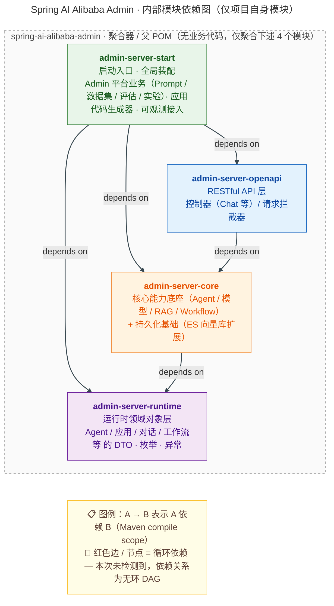

# 内部模块依赖图（Mermaid 源码）

> 渲染图见同名 SVG：[02-module-deps.svg](./02-module-deps.svg)
> 仅项目自身 4 个后端 Maven 模块；依赖为无环 DAG（无循环依赖）。

```mermaid
---
title: Spring AI Alibaba Admin · 内部模块依赖图（仅项目自身模块）
---
flowchart TB

  subgraph agg["spring-ai-alibaba-admin   ·   聚合器 / 父 POM（无业务代码，仅聚合下述 4 个模块）"]
    direction TB
    start["<b>admin-server-start</b><br/>启动入口 · 全局装配<br/>Admin 平台业务（Prompt / 数据集 / 评估 / 实验）· 应用代码生成器 · 可观测接入"]
    openapi["<b>admin-server-openapi</b><br/>RESTful API 层<br/>控制器（Chat 等）/ 请求拦截器"]
    core["<b>admin-server-core</b><br/>核心能力底座（Agent / 模型 / RAG / Workflow）<br/>+ 持久化基础（ES 向量库扩展）"]
    runtime["<b>admin-server-runtime</b><br/>运行时领域对象层<br/>Agent / 应用 / 对话 / 工作流等 的 DTO · 枚举 · 异常"]

    start -->|depends on| openapi
    start -->|depends on| core
    start -->|depends on| runtime
    openapi -->|depends on| core
    core -->|depends on| runtime
  end

  legend["📋 图例：A → B 表示 A 依赖 B（Maven compile scope）<br/>🔴 红色边 / 节点 = 循环依赖 — 本次未检测到，依赖关系为无环 DAG"]
  runtime ~~~ legend

  classDef cycle fill:#ffcdd2,stroke:#c62828,color:#b71c1c,stroke-width:2.5px
  linkStyle 0,1,2,3,4 stroke:#37474f,stroke-width:1.6px
  style agg fill:#fafafa,stroke:#9e9e9e,color:#424242,stroke-dasharray:4 4
  style start fill:#e8f5e9,stroke:#2e7d32,color:#1b5e20
  style openapi fill:#e3f2fd,stroke:#1565c0,color:#0d47a1
  style core fill:#fff3e0,stroke:#ef6c00,color:#e65100
  style runtime fill:#f3e5f5,stroke:#6a1b9a,color:#4a148c
  style legend fill:#fffde7,stroke:#fbc02d,color:#5d4037
```
