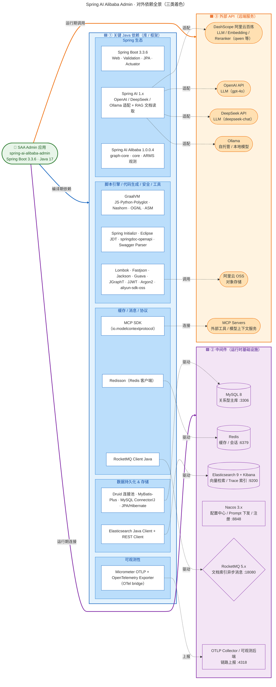

# 对外依赖全景图（Mermaid 源码）

> 渲染图见同名 SVG：[03-external-deps.svg](./03-external-deps.svg)
> 三类着色：🟦 关键 Java 依赖 · 🟪 中间件 · 🟧 外部 API；虚线为驱动/适配对应关系。

```mermaid
---
title: Spring AI Alibaba Admin · 对外依赖全景（三类着色）
---
flowchart LR

  App(["🧩 SAA Admin 应用<br/>spring-ai-alibaba-admin<br/>Spring Boot 3.3.6 · Java 17"])

  subgraph JAVA["🟦 ① 关键 Java 依赖（库 / 框架）"]
    direction TB
    subgraph J1["Spring 生态"]
      SB["Spring Boot 3.3.6<br/>Web · Validation · JPA · Actuator"]
      SAI["Spring AI 1.x<br/>OpenAI / DeepSeek / Ollama 适配 + RAG 文档读取"]
      SAA["Spring AI Alibaba 1.0.0.4<br/>graph-core · core · ARMS 观测"]
    end
    subgraph J2["数据持久化 & 存储"]
      PERSIST["Druid 连接池 · MyBatis-Plus · MySQL Connector/J · JPA/Hibernate"]
      ESCLIENT["Elasticsearch Java Client + REST Client"]
    end
    subgraph J3["缓存 / 消息 / 协议"]
      CACHE["Redisson（Redis 客户端）"]
      MQ["RocketMQ Client Java"]
      MCPSDK["MCP SDK（io.modelcontextprotocol）"]
    end
    subgraph J4["可观测性"]
      OBS["Micrometer OTLP + OpenTelemetry Exporter（OTel bridge）"]
    end
    subgraph J5["脚本引擎 / 代码生成 / 安全 / 工具"]
      SCRIPT["GraalVM JS·Python·Polyglot · Nashorn · OGNL · ASM"]
      GEN["Spring Initializr · Eclipse JDT · springdoc-openapi · Swagger Parser"]
      UTIL["Lombok · Fastjson · Jackson · Guava · JGraphT · JJWT · Argon2 · aliyun-sdk-oss"]
    end
  end

  subgraph MW["🟪 ② 中间件（运行时基础设施）"]
    direction TB
    MySQL[("MySQL 8<br/>关系型主库 :3306")]
    Redis[("Redis<br/>缓存 / 会话 :6379")]
    Elastic[("Elasticsearch 9 + Kibana<br/>向量检索 / Trace 索引 :9200")]
    Nacos["Nacos 3.x<br/>配置中心 / Prompt 下发 / 注册 :8848"]
    Rocket{"RocketMQ 5.x<br/>文档索引异步消息 :18080"}
    Otlp["OTLP Collector / 可观测后端<br/>链路上报 :4318"]
  end

  subgraph EXT["🟧 ③ 外部 API（远端服务）"]
    direction TB
    DashScope(["DashScope 阿里云百炼<br/>LLM / Embedding / Reranker（qwen 等）"])
    OpenAI(["OpenAI API<br/>LLM（gpt-4o）"])
    DeepSeek(["DeepSeek API<br/>LLM（deepseek-chat）"])
    Ollama(["Ollama<br/>自托管 / 本地模型"])
    OSS(["阿里云 OSS<br/>对象存储"])
    McpSrv(["MCP Servers<br/>外部工具 / 模型上下文服务"])
  end

  App ==>|编译期依赖| JAVA
  App ==>|运行期连接| MW
  App ==>|运行期调用| EXT

  PERSIST -.驱动.-> MySQL
  CACHE -.驱动.-> Redis
  ESCLIENT -.驱动.-> Elastic
  MQ -.驱动.-> Rocket
  OBS -.上报.-> Otlp

  SAI -.适配.-> DashScope
  SAI -.适配.-> OpenAI
  SAI -.适配.-> DeepSeek
  SAI -.适配.-> Ollama
  UTIL -.调用.-> OSS
  MCPSDK -.连接.-> McpSrv

  style App fill:#e8f5e9,stroke:#2e7d32,color:#1b5e20,stroke-width:2.5px
  style JAVA fill:#e3f2fd,stroke:#1565c0,color:#0d47a1,stroke-width:2px
  style MW fill:#f3e5f5,stroke:#7b1fa2,color:#4a148c,stroke-width:2px
  style EXT fill:#fff3e0,stroke:#ef6c00,color:#e65100,stroke-width:2px

  style J1 fill:#bbdefb,stroke:#1976d2,color:#0d47a1
  style J2 fill:#bbdefb,stroke:#1976d2,color:#0d47a1
  style J3 fill:#bbdefb,stroke:#1976d2,color:#0d47a1
  style J4 fill:#bbdefb,stroke:#1976d2,color:#0d47a1
  style J5 fill:#bbdefb,stroke:#1976d2,color:#0d47a1

  style SB fill:#ffffff,stroke:#1565c0
  style SAI fill:#ffffff,stroke:#1565c0
  style SAA fill:#ffffff,stroke:#1565c0
  style PERSIST fill:#ffffff,stroke:#1565c0
  style ESCLIENT fill:#ffffff,stroke:#1565c0
  style CACHE fill:#ffffff,stroke:#1565c0
  style MQ fill:#ffffff,stroke:#1565c0
  style MCPSDK fill:#ffffff,stroke:#1565c0
  style OBS fill:#ffffff,stroke:#1565c0
  style SCRIPT fill:#ffffff,stroke:#1565c0
  style GEN fill:#ffffff,stroke:#1565c0
  style UTIL fill:#ffffff,stroke:#1565c0

  style MySQL fill:#f3e5f5,stroke:#7b1fa2
  style Redis fill:#f3e5f5,stroke:#7b1fa2
  style Elastic fill:#f3e5f5,stroke:#7b1fa2
  style Nacos fill:#f3e5f5,stroke:#7b1fa2
  style Rocket fill:#f3e5f5,stroke:#7b1fa2
  style Otlp fill:#f3e5f5,stroke:#7b1fa2

  style DashScope fill:#ffe0b2,stroke:#ef6c00
  style OpenAI fill:#ffe0b2,stroke:#ef6c00
  style DeepSeek fill:#ffe0b2,stroke:#ef6c00
  style Ollama fill:#ffe0b2,stroke:#ef6c00
  style OSS fill:#ffe0b2,stroke:#ef6c00
  style McpSrv fill:#ffe0b2,stroke:#ef6c00

  linkStyle 0 stroke:#1565c0,stroke-width:2.5px
  linkStyle 1 stroke:#7b1fa2,stroke-width:2.5px
  linkStyle 2 stroke:#ef6c00,stroke-width:2.5px
```
