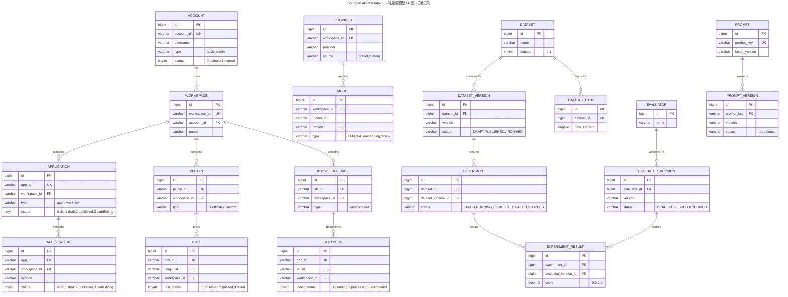

# 核心数据模型 ER 图（Mermaid 源码）

> 渲染图见同名 SVG：[06-data-model-er.svg](./06-data-model-er.svg)
> 两域关键关系：Builder（agentscope 库）/ 评估（admin 库）。实体仅列 PK · 业务键 · 关键 FK · 枚举。

```mermaid
---
title: Spring AI Alibaba Admin · 核心数据模型 ER 图（关键关系）
---
erDiagram
  %% ===== Builder 域（agentscope 库）=====
  ACCOUNT           ||--o{ WORKSPACE       : "owns"
  WORKSPACE         ||--o{ APPLICATION     : "contains"
  WORKSPACE         ||--o{ PLUGIN          : "contains"
  WORKSPACE         ||--o{ KNOWLEDGE_BASE  : "contains"
  APPLICATION       ||--o{ APP_VERSION     : "versions"
  PLUGIN            ||--o{ TOOL            : "tools"
  KNOWLEDGE_BASE    ||--o{ DOCUMENT        : "documents"
  PROVIDER          ||--o{ MODEL           : "models"

  %% ===== 评估域（admin 库）=====
  DATASET           ||--o{ DATASET_VERSION   : "versions FK"
  DATASET           ||--o{ DATASET_ITEM      : "items FK"
  EVALUATOR         ||--o{ EVALUATOR_VERSION : "versions FK"
  DATASET_VERSION   ||--o{ EXPERIMENT        : "runs-on"
  EXPERIMENT        ||--o{ EXPERIMENT_RESULT : "results"
  EVALUATOR_VERSION ||--o{ EXPERIMENT_RESULT : "scores"
  PROMPT            ||--o{ PROMPT_VERSION    : "versions"

  %% ----- Builder 实体（精简：PK / 业务键 / 关键 FK / 枚举）-----
  ACCOUNT {
    bigint   id         PK
    varchar  account_id UK
    varchar  username
    varchar  type       "basic,admin"
    tinyint  status     "0 deleted,1 normal"
  }
  WORKSPACE {
    bigint   id          PK
    varchar  workspace_id UK
    varchar  account_id  FK
    varchar  name
  }
  APPLICATION {
    bigint   id           PK
    varchar  app_id       UK
    varchar  workspace_id FK
    varchar  type         "agent,workflow"
    tinyint  status       "0 del,1 draft,2 published,3 pubEditing"
  }
  APP_VERSION {
    bigint   id           PK
    varchar  app_id       FK
    varchar  workspace_id FK
    varchar  version
    tinyint  status       "0 del,1 draft,2 published,3 pubEditing"
  }
  PLUGIN {
    bigint   id           PK
    varchar  plugin_id    UK
    varchar  workspace_id FK
    varchar  type         "1 official,2 custom"
  }
  TOOL {
    bigint   id           PK
    varchar  tool_id      UK
    varchar  plugin_id    FK
    varchar  workspace_id FK
    tinyint  test_status  "1 notTested,2 passed,3 failed"
  }
  KNOWLEDGE_BASE {
    bigint   id           PK
    varchar  kb_id        UK
    varchar  workspace_id FK
    varchar  type         "unstructured"
  }
  DOCUMENT {
    bigint   id           PK
    varchar  doc_id       UK
    varchar  kb_id        FK
    varchar  workspace_id FK
    tinyint  index_status "1 pending,2 processing,3 completed"
  }
  PROVIDER {
    bigint   id           PK
    varchar  workspace_id FK
    varchar  provider
    varchar  source       "preset,custom"
  }
  MODEL {
    bigint   id           PK
    varchar  workspace_id FK
    varchar  model_id
    varchar  provider     FK
    varchar  type         "LLM,text_embedding,rerank"
  }

  %% ----- 评估实体 -----
  DATASET {
    bigint   id   PK
    varchar  name
    tinyint  deleted "0,1"
  }
  DATASET_VERSION {
    bigint   id          PK
    bigint   dataset_id  FK
    varchar  version
    varchar  status      "DRAFT,PUBLISHED,ARCHIVED"
  }
  DATASET_ITEM {
    bigint   id          PK
    bigint   dataset_id  FK
    longtext data_content
  }
  EVALUATOR {
    bigint   id   PK
    varchar  name
  }
  EVALUATOR_VERSION {
    bigint   id           PK
    bigint   evaluator_id FK
    varchar  version
    varchar  status       "DRAFT,PUBLISHED,ARCHIVED"
  }
  EXPERIMENT {
    bigint   id                  PK
    bigint   dataset_id          FK
    bigint   dataset_version_id  FK
    varchar  status              "DRAFT,RUNNING,COMPLETED,FAILED,STOPPED"
  }
  EXPERIMENT_RESULT {
    bigint   id                   PK
    bigint   experiment_id        FK
    bigint   evaluator_version_id FK
    decimal  score                "0.0-1.0"
  }
  PROMPT {
    bigint   id           PK
    varchar  prompt_key   UK
    varchar  latest_version
  }
  PROMPT_VERSION {
    bigint   id          PK
    varchar  prompt_key  FK
    varchar  version
    varchar  status      "pre,release"
  }
```
